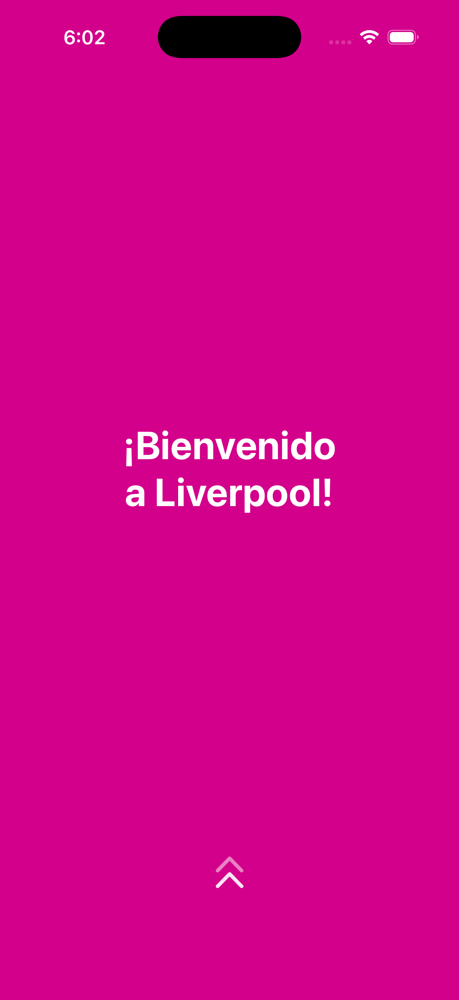
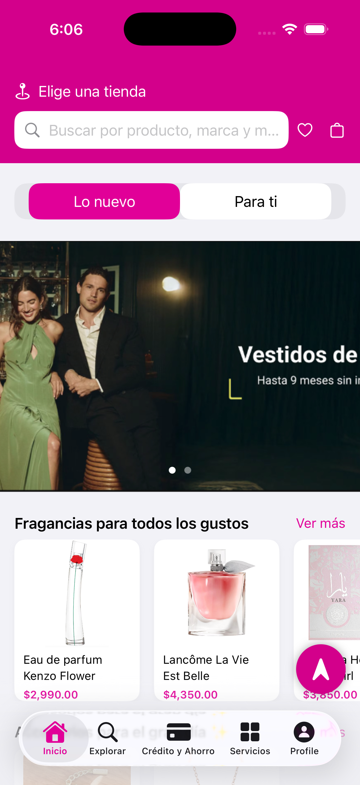
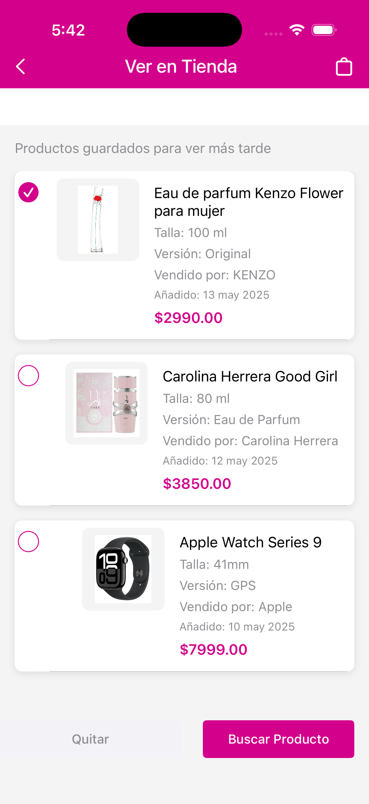
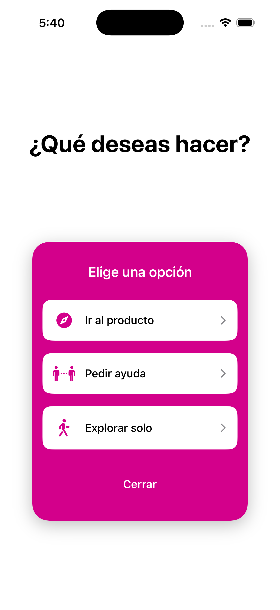
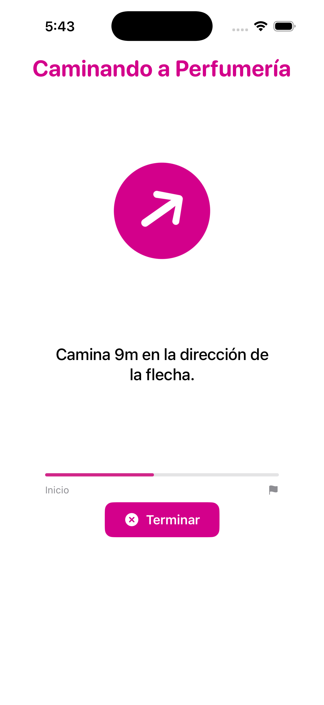
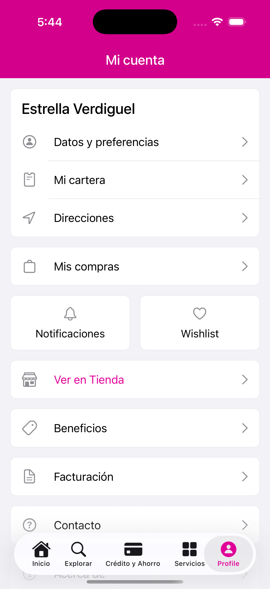
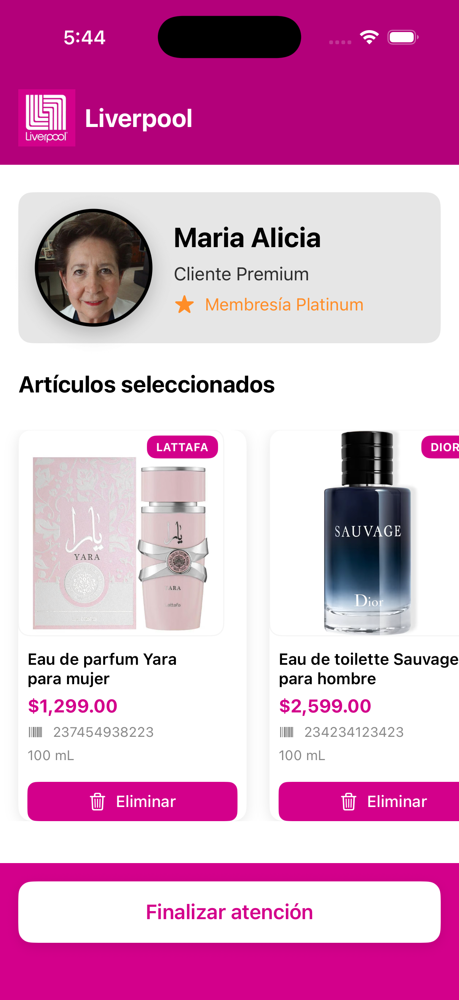
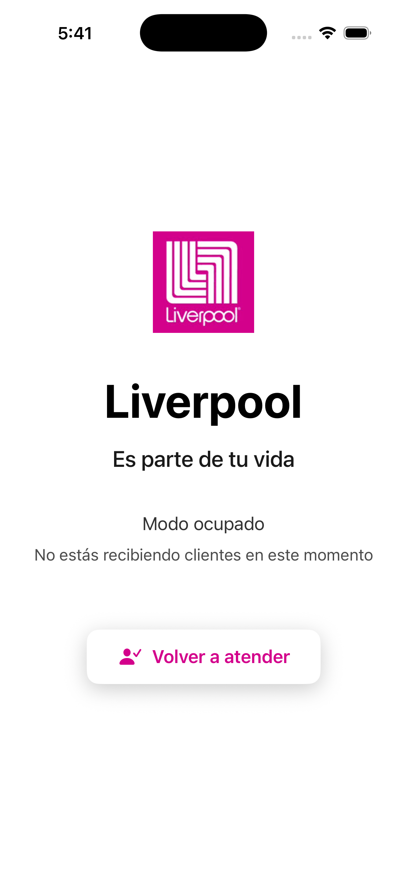

#  Liverpool OMNI

<div align="center">


**Enhanced shopping experience with Augmented Reality for Liverpool stores**

[Features](#-key-features) • [Technologies](#-technologies) • [Installation](#-installation) • [Architecture](#-architecture)

</div>

---

## 🎯 Description

**HackLiverpool** is an iOS application developed during teh National Swift Hackathon in Mexico 🇲🇽 that extends the capabilities of Liverpool Pocket. Using **Augmented Reality** and **location services**, the app transforms the in-store shopping experience, allowing users to navigate to specific products through AR visual guides, connect with store staff, or explore independently.

## ✨ Key Features

### 🔍 AR Navigation
- Visual guides in augmented reality to specific products
- 3D directional indicators with smooth animations
- Real-time progress bar
- Waypoint system for precise navigation

### 👥 Personalized Assistance
- Instant connection with store employees
- Attention management system for staff
- Real-time status for staff: Available, Busy, Attending

### 🛍️ Interactive Catalog
- Product exploration with complete details
- Integrated wishlist to save products
- Size, color, and quantity selectors
- Purchase options: Click & Collect and home delivery

### 🗺️ Independent Exploration
- Free navigation through the store
- Scannable product information
- Integration with store maps

## 🛠️ Technologies

- **SwiftUI** - Modern user interface framework
- **ARKit** - Native iOS augmented reality
- **CoreLocation** - Location and orientation services
- **SceneKit** - 3D rendering for AR elements
- **Combine** - Reactive programming
- **MapKit** - Map functionalities

## 📋 Requirements

- iOS 18.2 or higher
- ARKit-compatible device
- Location and camera permissions

## 🚀 Installation

```bash
# Clone the repository
git clone https://github.com/zepedag/HackLiverpool.git

# Navigate to directory
cd HackLiverpool

# Open project in Xcode
open HackLiverpool.xcodeproj
```

**Permission setup:**
The `Info.plist` file already includes the necessary descriptions for location and camera permissions.

## 🏗️ Architecture

```
HackLiverpool/
├── Views/
│   ├── Welcome/              # Onboarding and experience selection
│   ├── Home/                 # Product catalog
│   ├── Model/                # AR and location services
│   └── PantallasApoyo/       # Auxiliary views
├── Profile/                  # Profile and store management
└── Assets.xcassets/          # Graphic resources
```

### Key Components

**ARDirectionView** - AR navigation system with world tracking and 3D rendering

**LocationManager** - GPS management, magnetic orientation, and directional calculations

**ProductsView** - Dynamic catalog with wishlist management and purchase options

**WorkerView** - Employee interface with attention status management

## 📱 User Flow

1. **Welcome** → Initial screen with animation
2. **Experience selection** → Three available options:
   - 🔍 Go to product (AR Navigation)
   - 👥 Ask for help (Connect with employee)
   - 🚶 Explore alone (Free roaming)
3. **Main navigation** → TabView with 5 sections, regular Home Page of Liverpool Pocket but with the improved Wishlist.

## Screenshots

### User Interface

<table>
  <tr>
    <td align="center">
      <br />
      <b>Welcome</b>
    </td>
    <td align="center">
      <br />
      <b>Home</b>
    </td>
    <td align="center">
      <br />
      <b>Wishlist</b>
    </td>
  </tr>
  <tr>
    <td align="center">
      <br />
      <b>Menu</b>
    </td>
    <td align="center">
      <br />
      <b>AR Navigation</b>
    </td>
    <td align="center">
      <br />
      <b>Account</b>
    </td>
  </tr>
</table>

### Employee Interface

<table>
  <tr>
    <td align="center">
      <br />
      <b>Attending Customer</b>
    </td>
    <td align="center">
      <br />
      <b>Employee Busy</b>
    </td>
  </tr>
</table>

## Development Team

Developed during a hackathon as an extension for Liverpool Pocket.

**Humberto Zepeda**
- GitHub: [@zepedag](https://github.com/zepedag)

**Estrella Verdigel**
- GitHub: [@EstrellaVer](https://github.com/EstrellaVer)

---

<div align="center">

**Made with 🩷 and Swift during Hack Liverpool**

</div>
